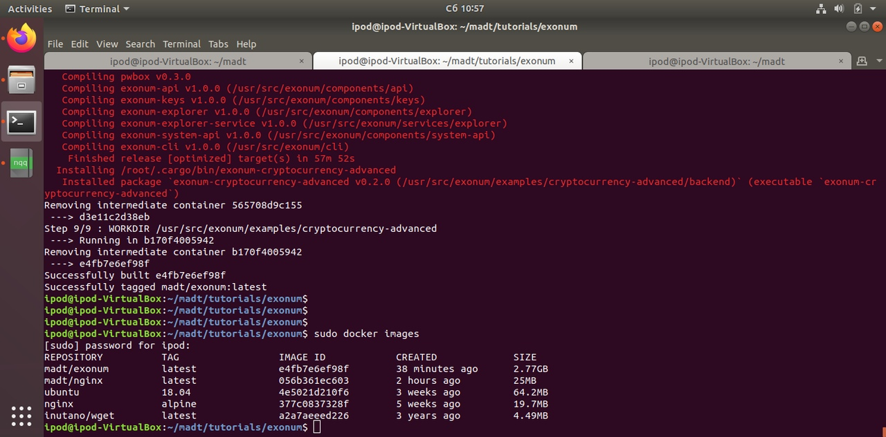
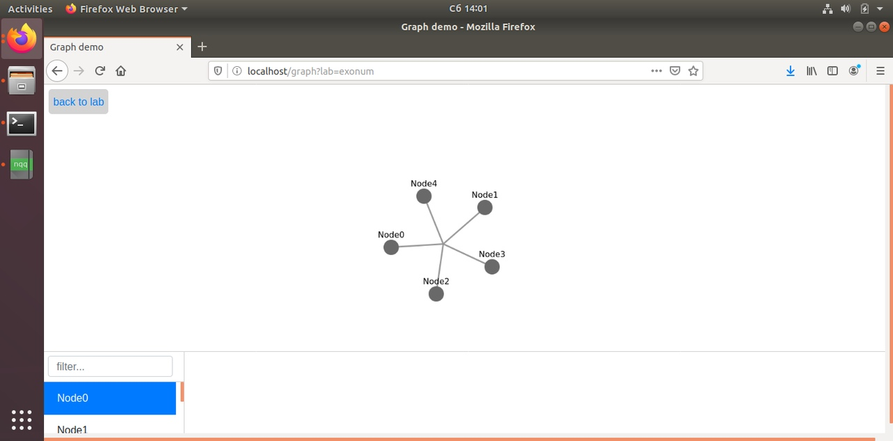

# MADT_Exonum

1. Скачайте и запустите MADT:
```
cd ~
git clone --recursive https://github.com/dltcspbu/madt/
mkdir ~/madt/labs && export MADT_LABS_DIR=$HOME/madt/labs
mkdir ~/madt/sockets && export MADT_LABS_SOCKETS_DIR=$HOME/madt/sockets

cd madt
sudo pip3 install -r ./requirements.txt
sudo make && sudo make install

sudo -HE env PYTHONPATH=$HOME/madt:$PYTHONPATH SSH_PWD=demo python3 madt_ui/main.py 80  
```

2. Соберите образ и запустите lab.py:
```
#open new terminal window
docker build -t madt/exonum .
python3 ./lab.py
```


3. Перейдите на 127.0.0.1:80, для login используйте: `demo:demo`
4. После открытия лаборатории вы должны увидеть следующее: 
5. Проверьте, что все контейнеры запущены:

6. Запустите скрипт для тестирования:
```
cd ./tests
bash test.sh
```
7. Пример запуска и тестирования:


  * Запускаем MADT; 
  ```
  sudo -HE env PYTHONPATH=$HOME/madt:$PYTHONPATH SSH_PWD=demo python3 madt_ui/main.py 80  
  ```
  * Запускаем лабораторию с заранее собранным образом:
  ```
  sudo python3 ./lab.py
  ```
  * Проверяем статус нашей лаборатории используя MADT UI;
  * Проверяем, что контейнеры работают;
  * Проверяем работоспособность с помощью ./tests/test.sh:
  ```
  1) Запускаем узлы;
  2) Создаём два кошелька;
  3) В первый кошелёк добавляем средства;
  4) Переправляем средства с одного кошелька на второй;
  5) Проверяем счёт первого кошелька;
  6) Проверяем счёт второго кошелька.
  ```

  
8. Для запуска узлов используйте скрипт:
```
bash runNodes.sh

As result:
new node with ports: 8000 (public) and 8050 (private)
new node with ports: 8001 (public) and 8051 (private)
new node with ports: 8002 (public) and 8052 (private)
new node with ports: 8003 (public) and 8053 (private)
new node with ports: 8004 (public) and 8054 (private)
```

