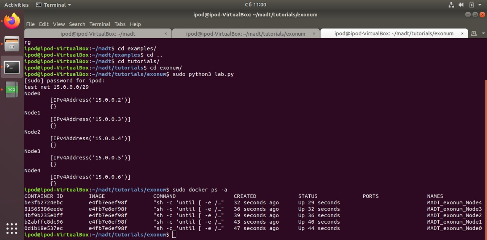

To run:

1. Download and start MADT
```
cd ~
git clone --recursive https://github.com/dltcspbu/madt/
mkdir ~/madt/labs && export MADT_LABS_DIR=$HOME/madt/labs
mkdir ~/madt/sockets && export MADT_LABS_SOCKETS_DIR=$HOME/madt/sockets

cd madt
sudo pip3 install -r ./requirements.txt
sudo make && sudo make install

sudo -HE env PYTHONPATH=$HOME/madt:$PYTHONPATH SSH_PWD=demo python3 madt_ui/main.py 80  
```

2. Build images and start the lab
```
#open new terminal window
docker build -t madt/exonum .
python3 ./lab.py
```


3. Open 127.0.0.1:80
4. login as `demo:demo`
5. Open lab 
6. Observe graph
7. Check


